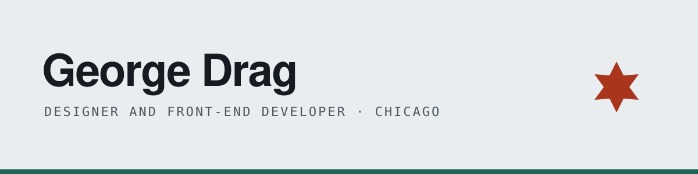
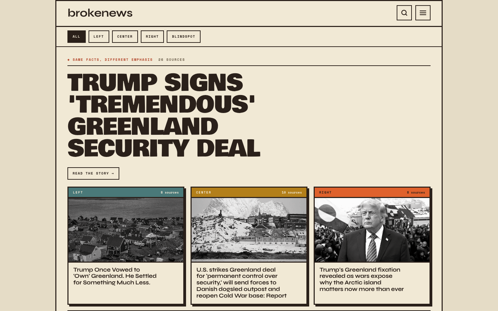
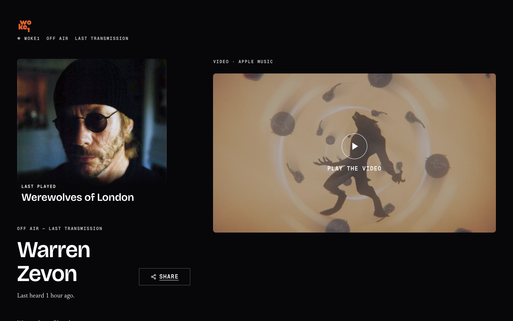
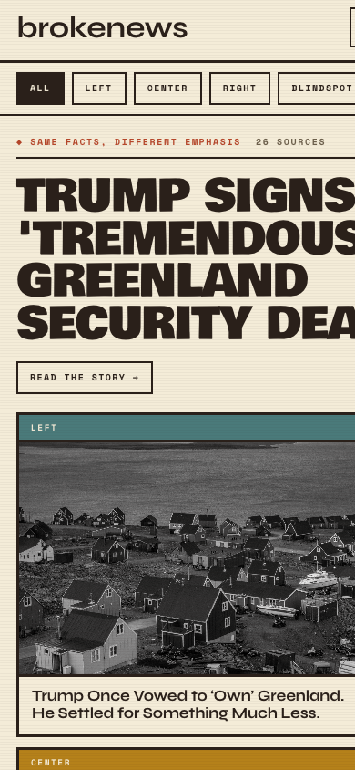
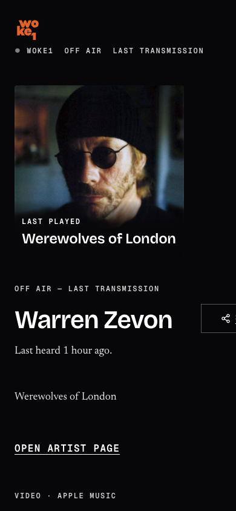

<picture>
  <source media="(prefers-color-scheme: dark)" srcset="assets/banner-dark.svg">
  
</picture>

For fourteen years I built iOS, Android and web products at a Chicago software consultancy. Small shop, so I worked with clients through the whole process: design, build, testing, launch.

Now I design and build my own.

## Live

<table>
<tr>
<td width="50%" valign="top">

 <strong><a href="https://brokenews.co">brokenews.co</a></strong> 
The same story from the left, the center and the right, side by side.
</td>
<td width="50%" valign="top">

 <strong><a href="https://woke1.org">woke1.org</a></strong> 
A personal radio station. What's playing, and the artist behind it.
</td>
</tr>
</table>

&nbsp;

Two products, two visual identities, one method: phone width first, accessibility checked against WCAG as part of the build, then iterate on what real use shows.

## At home

**[Boop](https://github.com/gtdrag/boop)**. A private assistant that runs on two small computers in my house. One memory of every project, decision and goal I have, and a second opinion on what matters next.

## Tools

HTML · CSS · TypeScript · React · React Native · Swift · Python
